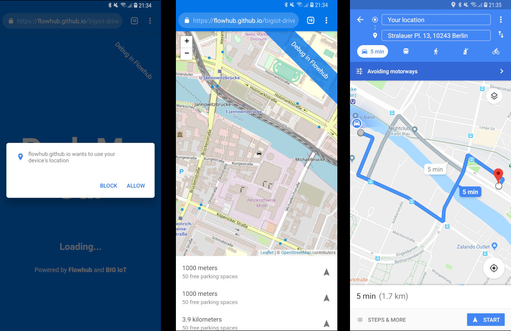

# ParkMyCar

Demomonstrates simple webapp development with [BIG IoT](http://big-iot.eu),
using [NoFlo](https://noflojs.org) Flow-based-programming framework and [Flowhub](https://flowhub.io)
visual programming IDE.

ParkMyCar gets available parking spots from BIG IoT Marketplace, lets the user select between them
and then get navigation directions using Google Maps.



PackMyCar is a progressive webapp. It can be added to the homescreen, which
will cache the assets for faster startup, remove the browser bar and show the app together with other running apps. 


## Live version
Go to [flowhub.github.io/bigiot-driver-app](https://flowhub.github.io/bigiot-driver-app)


## Run locally

Install dependencies

```bash
npm install
```

Start a local development server with:

```bash
npm start
```

Open [localhost:8080](http://localhost:8080). This will rebuild your sources as needed.

Run the tests with:

```bash
npm test
```
